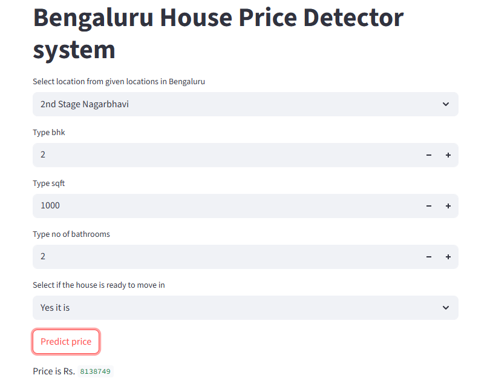

# 🏠 Bengaluru House Price Predictor

This project is a **machine learning-based web application** to predict house prices in Bengaluru using a **Random Forest** algorithm.  

You enter details such as:
- Location
- Number of bedrooms (BHK)
- Square footage
- Number of bathrooms
- Availability (Ready to move or not)

and the app predicts the expected price of the property.

---

## 📂 Project Workflow

1️⃣ **Data Preprocessing & Model Training**
- Data was taken from the Kaggle dataset: [Bengaluru House Price Dataset](https://www.kaggle.com/datasets/lovishbansal123/dataset-for-bengaluru-house-price-prediction).
- Cleaned and preprocessed the data in **Jupyter Notebook**.
- Trained a **Random Forest Regressor**.
- Saved the trained pipeline (including preprocessing & model) using `pickle` into a file: `pipeline.pkl`.

2️⃣ **Web Application**
- Built an interactive web app using **Streamlit**.
- The app loads the `pipeline.pkl` file and provides an intuitive interface to input property details and predict the price.
- The UI looks like the screenshot below 👇

---

## 🌟 Screenshots of the App

| Screenshot 1|
|------------|
|  |

| Screenshot 2|
|------------|
|  |

| Screenshot 3|
|------------|
|  |

---

## 🚀 How to Run

### Install dependencies
```bash
pip install -r requirements.txt
```

### Run the web app
```bash
streamlit run app.py
```

Then open the provided URL in your browser to use the app.

---

## 📄 Files in this project

| File/Folder        | Description                                    |
|---------------------|-----------------------------------------------|
| `Bengaluru_House_Data.csv` | Raw dataset |
| `notebook.ipynb`    | Jupyter notebook for data cleaning & training |
| `pipeline.pkl`      | Pickled trained model pipeline |
| `app.py`            | Streamlit app code |
| `requirements.txt`  | Python dependencies |
| `screenshot*.png`   | App screenshots |

---

## ✨ Tech Stack

- Python
- Scikit-learn
- Pandas, Numpy
- Streamlit
- Random Forest Regression

---

Feel free to fork the repository, improve the UI, or try other models!

---

### 🔗 Author
Made with ❤️ for educational purposes.
